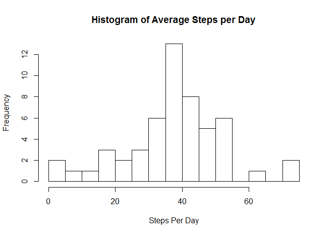

# Reproducible Research: Peer Assessment 1


## Loading and preprocessing the data  
  
The data used for this analysis was collected from an anonymous user for the monthsof October and November in 2012.  The consists of the number of steps taken in 5 minute intervals collected from an unspecified personal activity monitoring device.  
  
The data was stored as a .csv file and was loaded into R for the analysis as follows:  
  

```r
activity <- read.csv("./data/activity.csv")
head(activity)
```

```
##   steps       date interval
## 1    NA 2012-10-01        0
## 2    NA 2012-10-01        5
## 3    NA 2012-10-01       10
## 4    NA 2012-10-01       15
## 5    NA 2012-10-01       20
## 6    NA 2012-10-01       25
```

```r
summary(activity)
```

```
##      steps                date          interval     
##  Min.   :  0.00   2012-10-01:  288   Min.   :   0.0  
##  1st Qu.:  0.00   2012-10-02:  288   1st Qu.: 588.8  
##  Median :  0.00   2012-10-03:  288   Median :1177.5  
##  Mean   : 37.38   2012-10-04:  288   Mean   :1177.5  
##  3rd Qu.: 12.00   2012-10-05:  288   3rd Qu.:1766.2  
##  Max.   :806.00   2012-10-06:  288   Max.   :2355.0  
##  NA's   :2304     (Other)   :15840
```

No preprocessing was required. The significant number of NA values will be treated at a later time in the analysis. 
  

## What is mean total number of steps taken per day?

Starting with some exploratory analysis, the total number of steps taken per day (ignoring the NA values) is calculated and a histogram of this data is plotted.  
  
  

```r
stepsperday<-tapply(activity$steps,activity$date,mean,na.rm = TRUE)
hist(stepsperday, breaks= 20, xlab = "Steps Per Day", main = "Histogram of Average Steps per Day")
```

 
  
The mean and the median of the total steps taken per day was also calculated as follows:  
  

```r
mean(stepsperday, na.rm = TRUE)
```

```
## [1] 37.3826
```

```r
median(stepsperday, na.rm = TRUE)
```

```
## [1] 37.37847
```
  

## What is the average daily activity pattern?
  
To help assess the average peak activity time across the time period, a time series plot is drawn.  
  

```r
stepsperinterval<-tapply(activity$steps,activity$interval,mean,na.rm = TRUE)
intervalframe <- data.frame(stepsperinterval)
plot(rownames(intervalframe),intervalframe$stepsperinterval,type = "l", xlab = "5-Minute Interval", ylab = "Average Steps", main = "TIme Series Plot of Average Steps per Day")
```

 
  
The peak 5-minute interval is the period beginning at minute 835 of each day with a average of just over 206 steps:  
  

```r
intervalframe[stepsperinterval == max(intervalframe),]
```

```
##      835 
## 206.1698
```
  

## Imputing missing values
  
To address the NA values, the NA values were replaced with the Mean Steps per Period.  The total number of missing values are 2304.  


```r
sum(is.na(activity))
```

```
## [1] 2304
```

```r
fullactivity<- activity
fullactivity[is.na(activity)] <- mean(activity$steps,na.rm=TRUE)
```
  
  
The result of this replacement did not affect the Mean of the dataset but shifted to the Median to be equivalent to the Mean.  
  

```r
fullstepsperday<-tapply(fullactivity$steps,fullactivity$date,mean)
hist(fullstepsperday, breaks= 20, xlab = "Steps Per Day", main = "Histogram of Average Steps per Day (Imputed)")
```

 

```r
mean(fullstepsperday)
```

```
## [1] 37.3826
```

```r
median(fullstepsperday)
```

```
## [1] 37.3826
```
  
## Are there differences in activity patterns between weekdays and weekends?
  
To assess any differences in weekday vs. weekend activity, a new factor variable was created.
  

```r
fullactivity <- cbind(fullactivity,fullactivity$date)
fullactivity[,4] <- weekdays(as.Date(fullactivity[,4]))
convert_day <- function(day){
  wkend <- c("Saturday", "Sunday")
  wkday <- c("Monday", "Tuesday","Wednesday","Thursday","Friday")
  
  if (day %in% wkend) {
    return("Weekend")
  } else if (day %in% wkday) {
    return("Weekday")
  } else {
    return("NA")
  }
}
x <- sapply(fullactivity[,4], convert_day)
fullactivity <- cbind(fullactivity,x)

testsum <- aggregate(fullactivity$steps ~ fullactivity$interval+fullactivity[,5], data = fullactivity, mean)
colnames(testsum) <- c("Interval", "Day_Type", "Ave_Steps")
```
  
The pair of time series plots below illustrates some clear differences. The peak weekday steps are much higher and slightly earlier than the weekend, suggesting possibility an active commute to work.  The weekday step count then remains much lower the rest of the day suggesting this individual is largely sedentary while at work.
  

```r
library("ggplot2", lib.loc="~/R/win-library/3.1")
qplot(x=Interval, y=Ave_Steps, data=testsum, facets = Day_Type ~., geom = "line")
```

 

